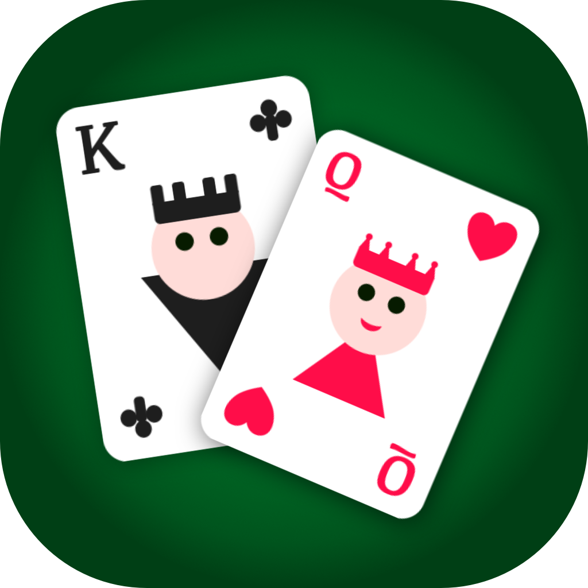
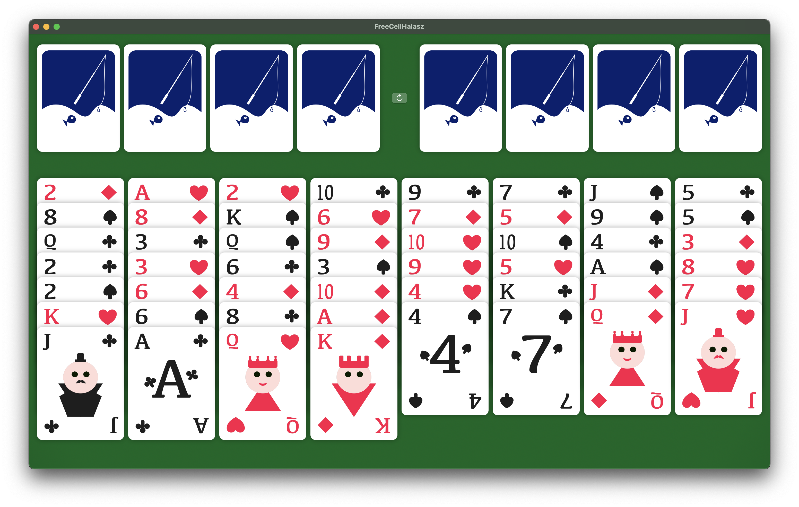

# FreeCell Halasz

A FreeCell card game for MacOS & iOS using a shared codebase written in SwiftUI.

The game is designed as a MacOS application, it runs best on devices with big screens, but it is also playable on smaller screen Apple devices.

The application starts off by dealing a deck of cards into 8 columns always in a ranndom order. A user can drag and drop a card or stack of cards into other columns, or duble click on them to move them either to the trailing side of stacks or to the leading side, based on whether they are already part of the solution or not.

## Screenshots

